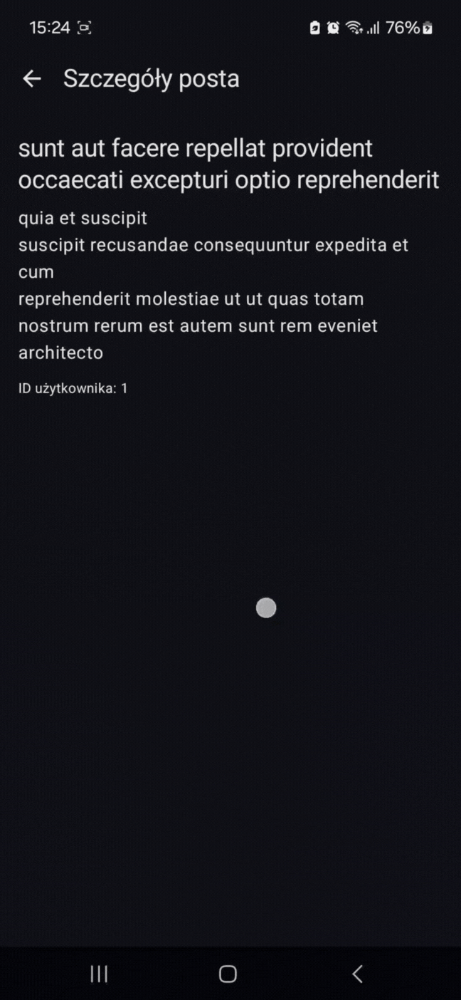

# PostApp Readme
# Zawartość projektu
* [Informacje ogólne](#informacje-ogólne)
* [Funkcjonalności](#funkcjonalności)
* [Problemy](#problemy)
* [Technologie](#technologie)
## Informacje ogólne
  Aplikacja mobilna oparta na Jetpack Compose, umożliwiająca przeglądanie postów, użytkowników oraz szczegółów zadania. Dane są pobierane z API: https://jsonplaceholder.typicode.com
## Funkcjonalności
### Ekran Główny - Lista Postów z Użytkownikami
<ul>
  <li>Pobieranie listy postów i użytkowników z API.</li>
  <li>Wyświetlanie w LazyColumn.</li>
  <li>Kliknięcie tytułu posta → przejście do szczegółów posta.</li>
  <li>Kliknięcie autora → przejście do szczegółów użytkownika.</li>
</ul>
GIF działania: 
 

### Ekran Szczegółów Posta
<ul>
  <li>Pobieranie pojedynczego posta na podstawie postId.</li>
  <li>Wyświetlanie tytułu, treści i ID autora.</li>
  <li>Możliwość powrotu do ekranu głównego.</li>
</ul>
GIF działania:  

 

### Ekran Szczegółów Użytkownika
<ul>
  <li>Pobieranie danych użytkownika i jego zadań (todos)</li>
  <li>Wyświetlanie:</li>
    <ul>
      <li>Imienia, nazwiska</li>
      <li>Nazwy użytkownika</li>
      <li>E-maila, telefonu, strony</li>
      <li>Firmy i adresu</li>
    </ul>
  <li>Wyświetlanie listy zadań (todos) z checkboxem statusu.</li>
  <li>Możliwość powrotu do ekranu głównego.</li>
</ul>
GIF działania: 
 
 

### Obsługa Stanu Ładowania i Błędów
<ul>
  <li>CircularProgressIndicator podczas ładowania danych.</li>
  <li>Komunikat błędu i możliwość ponowienia zapytania w przypadku błędu sieci.</li>
</ul>
GIF działania:  
 

## Problemy
<ul>
  <li>Brak przycisku Spróbuj Ponownie w przypadku błędu sieci.</li>
</ul>

## Technologie
<ul>
  <li>Kotlin</li>
  <li>Jetpack Compose</li>
  <li>Retrofit</li>
  <li>Gson</li>
  <li>kotlinx.serialization</li>
  <li>MVVM</li>
  <li>Navigation Compose</li>
</ul>
